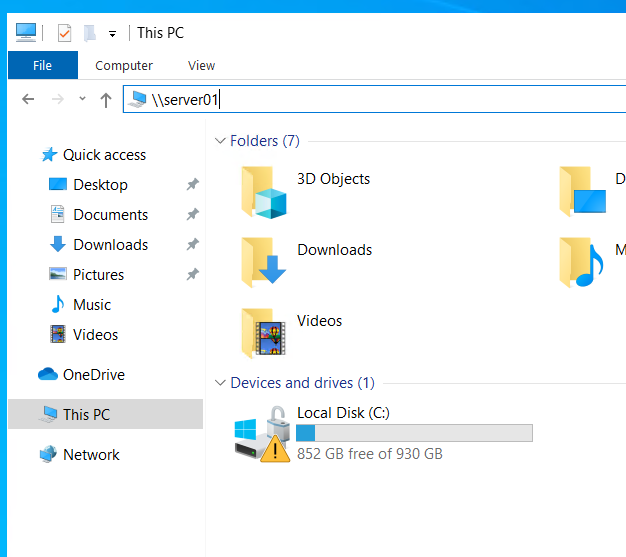
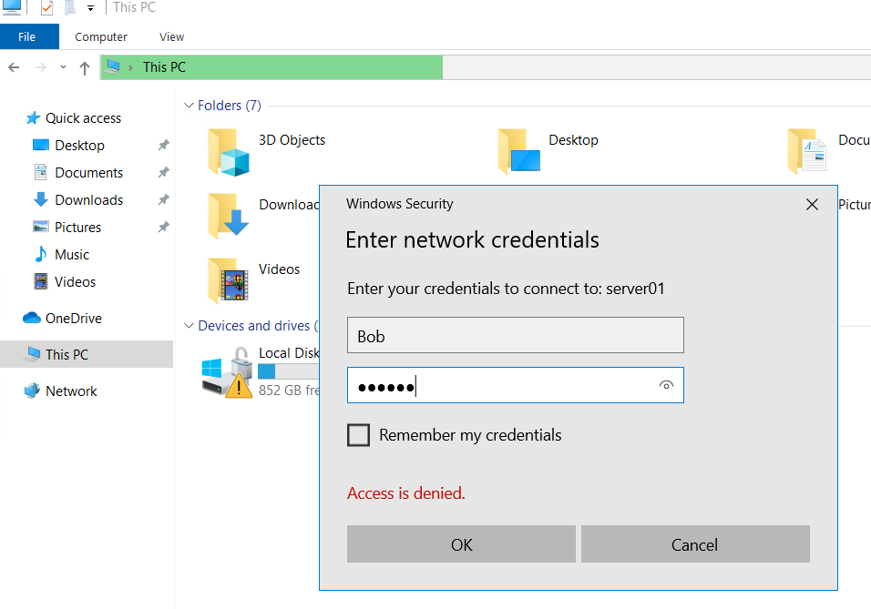
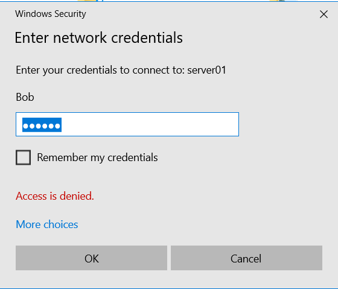

# Network-Hash-Capture-and-Cracking-with-Responder-and-Hashcat

This lab outlines the process of using Responder to capture an NTLMv2 hash from a Windows 10 host over the network and then cracking the captured hash with Hashcat to expose the password. This lab was conducted in a segmented LAN environment for testing purposes.

The Responder tool listens for network events through the eth0 interface. While it is running, I will capture the NTLMv2 hash of the Windows 10 target by attempting to authenticate to a nonexistent server named server01. Responder intercepts this authentication request and captures the NTLMv2 hash, performing this locally on the target system within the local network.

Here we have the captured NTLMv2 hash, which the Responder tool tricked the target system into sending over the network. By having the target host attempt to authenticate to a nonexistent server, Responder captured the NTLMv2 hash by poisoning the response to a broadcast query. From here, we can copy and paste the hash into a .txt file and run a wordlist against it using Hashcat to attempt to crack the hashed password.

